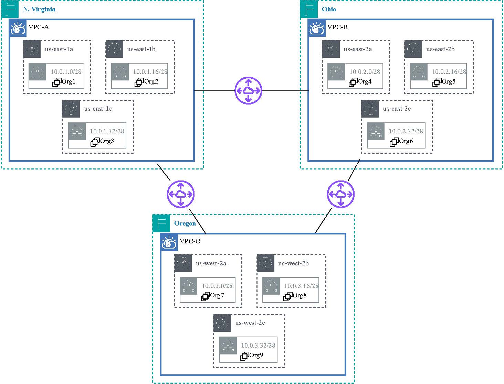

# Blockchain-Based Commit Reveal Voting System (BBVS)

This repository contains scripts and configurations for deploying a Hyperledger Fabric blockchain network for a voting system. The implementation supports a network with multiple organizations deployed on multi-region AWS Cloud, each with their own peers, and allows for dynamic network expansion. 
More details for multi-region AWS Cloud network setup: [Medium Link](https://medium.com/@satyam.th3/aws-multi-az-multi-region-network-using-vpc-peering-a-3-region-9-node-ec2-deployment-guide-86dc4b801572)

<p align="center">
  
  <br>
  <em>Figure: Cloud Network Topology</em>
</p>

## Prerequisites

Before starting, ensure your system meets the following requirements:

- Linux-based operating system (Ubuntu recommended)
- Docker and Docker Compose
- Go programming language
- Hyperledger Fabric binaries

## Setup Instructions

### 1. Install Prerequisites

Run the `requirements.sh` script to set up all necessary dependencies:

```bash
./requirements.sh
```

This script will:
- Update package lists
- Install required system dependencies
- Install Go v1.23.1
- Install Docker and Docker Compose
- Install Hyperledger Fabric binaries v2.5.9
- Configure environment variables

### 2. Deploy Blockchain Network

The base blockchain network consists of 3 organizations. To deploy it, run:

```bash
./deployblockchain.sh
```

This script performs the following actions:
- Starts Docker containers for orderer and peer nodes using `docker-compose_no-tls.yaml`
- Creates and configures channels using `createChannel_no-tls.sh`
- Deploys chaincode using `deployChaincode_no-tls1.sh` and `deployChaincode_no-tls.sh`

By default, the network will have:
- 1 orderer
- 3 organizations (Org1, Org2, Org3)
- 1 peer per organization
- CouchDB as the state database
- TLS disabled for simplicity

### 3. Adding a New Organization (Org4)

To add a fourth organization to the network, run:

```bash
# Start the Org4 peer and CouchDB containers
docker-compose -f artifacts/docker-compose_no-tls-peer4.yaml up -d

# Join the peer to existing channels and update anchor peers
./createChannel_Peer4.sh

# Deploy chaincode to the new organization
./deployChaincode_Org4.sh
./deployChaincode1_Org4.sh
```

This will:
- Add a new peer node for Org4
- Join the peer to the existing channels ('mychannel' and 'mychannel1')
- Update anchor peers for the organization
- Deploy and instantiate chaincode on the new peer

## Network Architecture

The blockchain network consists of:

- Orderer node: Responsible for transaction ordering and block creation
- Organizations (Org1, Org2, Org3, etc.): Each represents a voting authority or stakeholder
- Peer nodes: Each organization has at least one peer that maintains a copy of the ledger
- CouchDB instances: State databases for each peer
- Two channels: 'mychannel' and 'mychannel1' (can be used for different voting events)

## Available Scripts

- `requirements.sh`: Installs all required dependencies
- `deployblockchain.sh`: Deploys a 3-org blockchain network
- `createChannel_no-tls.sh`: Creates and configures channels for the network
- `deployChaincode_no-tls1.sh` and `deployChaincode_no-tls.sh`: Deploys and instantiates chaincode
- `createChannel_Peer4.sh`: Joins Org4's peer to the existing channels
- `deployChaincode_Org4.sh`: Deploys chaincode to Org4's peer
- `stopblockchain.sh`: Stops the running blockchain network
- `destroyblockchain.sh`: Removes all blockchain containers and artifacts

## Scaling the Network

The repository includes scripts for networks with different numbers of peers:
- `deployblockchain-5peer.sh`: Deploys a network with 5 peers
- `deployblockchain-7peer.sh`: Deploys a network with 7 peers
- `deployblockchain-9peer.sh`: Deploys a network with 9 peers

## Troubleshooting

If you encounter issues with the deployment:

1. Check Docker container status:
   ```bash
   docker ps -a
   ```

2. View container logs:
   ```bash
   docker logs <container-name>
   ```

3. Verify network connections:
   ```bash
   docker exec peer0.org1.example.com peer channel list
   ```

4. If necessary, destroy and redeploy:
   ```bash
   ./destroyblockchain.sh
   ./deployblockchain.sh
   ```

## License

This project is licensed under the MIT License - see the LICENSE file for details. 
